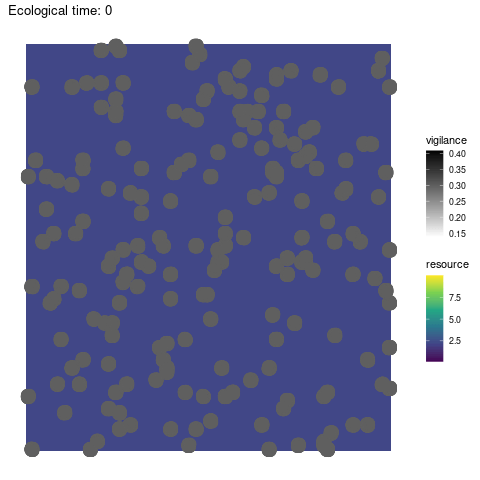
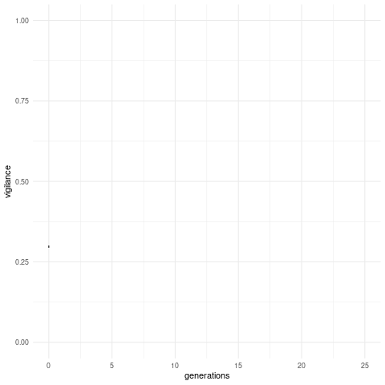

# vigilance-predation
Coding challenge assigned by Hanno Hildenbrandt for a programmer position at RUG (C++ version)

## Visual

Exploration                  | Trait evolution
:---------------------------:|:----------------------------:
 | 

## Model description

In this model, a population of prey roams around and collects resources from a bounded ecosystem. The ecosystem is a squared grid of a defined size. Predation risk is constant and diffused over the whole grid. Over a specific amount of time steps, an individual will repeat a routine as follows:

1. move on the ecosystem grid by one step, that is to say to a neighbouring grid cell. The destination cell is chosen randomly from the neighbouring cells (including the origin cell: the individual can stay on the same cell over one time step).
2. gather resources within their current cell, and add them to their storage. Let us consider there is a total of R resources in the cell at the time. When there are several individuals in the cell, they share the resources fairly as follows:

Where alpha is the gathering efficiency, n is the number of individuals in the cell, gamma is the competition level and v is the individual's vigilance level against predation. Vigilance is an evolving trait subject to mutation and natural selection, and is continuous (from 0 to 1). Kin selection being virtually inexistant in this model, and the sharing of resources representing a form of public good game, one could expect vigilance to tend to zero over time. However, vigilance is also under positive selection as it increases an individual's chances of survival.

3. the individual dies due to predation or survives to the next time step. The predation risk p is constant, and is defined by the probability for a prey to be eaten by a predator, in absence of vigilance. An individual's vigilance mitigates this risk, so that the probability to die at this time step is:

Resources in a cell grow at each time step at a growth rate r. If the cell was unoccupied and resources conserved, the amount of resources in the cell at the next time step is R x r. Otherwise, it is:

Cell resources cannot grow indefinitely: when the cell becomes overfull, a resources crash is triggered, leading the resources to go back to their initial amount. This can be thought of as a population collapse at the resource level, due to disease for instance.

After a number of time steps (user-defined), the individuals who survived reproduce according the resources they managed to store. The more resources in their storage, the higher their fertility. The number of offpsring produced by an individual follows a Poisson distribution where fertility is the mean. The next generation is produced following a Moran process: all offspring go into a pool, from which a fixed number of individuals is randomly selected to form the new generation. Offspring inherit their parents' vigilance level (subject to mutation), and start off on the grid cell where their parents were during reproduction. Generations are non-overlapping: all parents die after reproduction. As a result, the population size at the beginning of each life cycle is always the same. It may decrease over time until reproduction, due to predation. In the event where all individuals of a generation were to die from predation, the population goes extinct and the simulation stops.

## Installation

Simply download this repository and place wherever convenient on your machine.

## Requirements
This code was developped under Linux (Ubuntu 20.04.2 LTS) with C++ 20.

## Usage

After building, run the executable from command line, with the path to the folder where yous `parameters.txt` file is. This will also be the folder where the output will be saved. If `visual` is `1` in parameters, make sure to download [this repository](https://github.com/ClaireGuerin/anim-vigil) in the root of the program first.

### Parameters
Change parameter values in `Parameters.h`.

> `edgeSize` the length of one square ecosystem grid side, e.g. `10`.
> 
> `popSize` the number of individuals at the beginning of each generation, e.g. `20`.
> 
> `nGen` the number of generations to run the simulation for, e.g. `300`.
> 
> `ecoTime` the number of time steps in the life cycle before reproduction, e.g. `4`.
>
> `v` the initial vigilance level (phenotype) of each individual (population initially monomorphic), e.g. `0.5`.
> 
> `mutRate` the mutation rate, e.g. `0.01`.
> 
> `mutStep` the mutation step (variance), e.g. `0.005`.
> 
> `initResources` the initial amount of resources in each cell on the ecosystem grid, e.g. `1.0`.
> 
> `eff` the gathering efficiency of resources by preys (alpha), e.g. `0.8`.
> 
> `p` the basal predation rate in the absence of vigilance, e.g. `0.3`.
> 
> `competition` the competition level for shared resources (gamma), e.g. `2.1`.
> 
> `rGrowth` the resources natural growth rate (r), e.g. `1.2`.
>
> `maxGrowth` the maximum resources growth before crash, e.g. `200`.
>
> `residualFertility` fertility cannot be zero (poisson distribution), even when the individual has no resources, e.g. `0.0001`
> 
> `fecundity` the individual fecundity, e.g. `1.5`.
>
> `rdSeed` the random seed to launch the simulation, for reproducibility, e.g. `1`.
>
> `visual` boolean, whether you want to automatically launch visual, `0` for false and `1` for true.

## Roadmap

## Contributing
Pull requests are welcome. For major changes, please open an issue first to discuss what you would like to change.

## Authors and acknowledgements
General description of the model by Hanno Hildenbrandt.
Equations and code by Claire Guerin, with help from Hanno Hildenbrandt.

## License

[GPL-3.0](https://github.com/ClaireGuerin/vigilance-predation/blob/main/LICENSE)